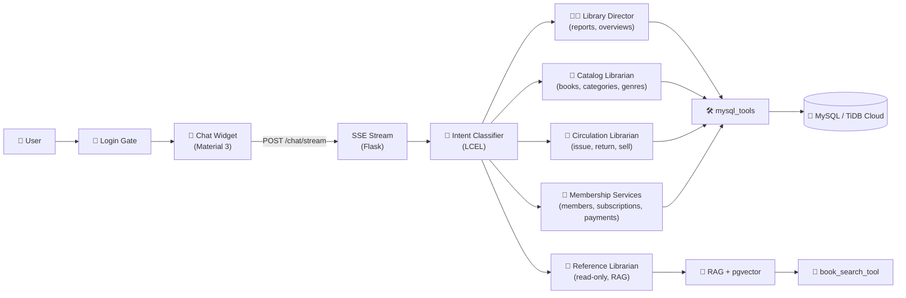

<p align="center">
  
</p>

<p align="center">
  <a href="https://library-management-system-dbms.onrender.com/" target="_blank">
    
  </a>
</p>

<p align="center">
  <a href="#features">Features</a> ·
  <a href="#architecture">Architecture</a> ·
  <a href="#agents">Agents</a> ·
  <a href="#quick-start">Quick Start</a> ·
  <a href="#configuration">Configuration</a> ·
  <a href="#api">API</a> ·
  <a href="#database">Database</a> ·
  <a href="#project-structure">Structure</a>
</p>

<p align="center">
  
  
  
  
  
  
  
  
</p>

---

A full-featured **college DBMS project**: a library management system backed by a real **MySQL** relational database (hosted on **TiDB Cloud**) with a Material 3 chat widget powered by five LangGraph librarian agents. Manage books, members, employees, subscriptions, payments, and issues — or just ask **Lumina Concierge** in plain language.

This is the **DBMS rewrite** of the original Google-Sheets-based app. All CRUD data now lives in a normalized MySQL schema instead of spreadsheets.

## Features

- **📚 Database-Backed CRUD** — 12 normalized tables (users, books, categories, genres, members, employees, subscriptions, payments, sales, issues, logs, customers)
- **🔐 Login & Role Gate** — Session-based auth; admin-only access to the audit `/logs` page; login/logout written to the DB
- **🧑‍💼 Multi-Agent AI Concierge** — Five specialized LangGraph agents (Catalog, Circulation, Membership, Reference, Director) routed by an intent classifier
- **⚡ Token-Level Streaming** — Agent replies stream live via Server-Sent Events (SSE) with a typing indicator
- **📄 Audit Logging** — Every login/logout recorded in the `logs` table
- **🗂️ Chat History & Resume** — Sessions persist; browse and resume past conversations
- **🔎 RAG Book Search** — Semantic book discovery via Mistral embeddings + pgvector
- **📱 Responsive UI** — Hanken Grotesk typography, Material 3 chat widget, dark "Reading Room" admin theme

## Architecture



| Layer | Technology |
|---|---|
| **Frontend** | Chat widget (Material 3, CSS), server-rendered admin pages (Jinja2) |
| **API** | Flask — REST CRUD + `POST /chat/stream` SSE |
| **Orchestration** | LangGraph StateGraph — classifier routes to 5 react agents |
| **LLM** | Mistral (`open-mistral-7b` via `langchain-mistralai`) |
| **RAG** | Mistral embeddings + pgvector (`book_embeddings` table) |
| **Database** | MySQL 8-compatible relational DB via PyMySQL |
| **Cloud DB** | TiDB Cloud (MySQL-compatible serverless) |
| **Deployment** | Render Web Service (`gunicorn flask_app:app`) |

## Agents

| Agent | Responsibility | Tools |
|---|---|---|
| **🧭 Intent Classifier** | Routes each message to the right specialist | LCEL structured output (Pydantic) |
| **🧑‍💼 Library Director** | Statistics, reports, overviews, greetings, ambiguous requests | SQL aggregates |
| **📖 Catalog Librarian** | Add/edit/delete books, categories, genres | `book_tools`, `book_cat`, `book_genre` |
| **🔄 Circulation Librarian** | Issue, return, and sell books | `book_issue`, `book_sell` |
| **👥 Membership Services** | Register members/employees, subscriptions, payments | `members`, `employees`, `subscriptions`, `payment` |
| **🔎 Reference Librarian** | Book discovery, recommendations, collection questions (read-only) | RAG + `book_search_tool` |

## Quick Start

```bash
git clone https://github.com/kairav7220/library-management-system-dbms.git
cd library-management-system-dbms
python -m venv .venv
.venv\Scripts\activate        # Windows
pip install -r requirements.txt
```

Copy `.env.example` to `.env` and fill in your keys (see [Configuration](#configuration)):

```env
SECRET_KEY="a_long_random_secret"
MYSQL_HOST="gateway01.ap-southeast-1.prod.aws.tidbcloud.com"
MYSQL_PORT=4000
MYSQL_USER="<tidb-user>.root"
MYSQL_PASSWORD="your_tidb_password"
MYSQL_DB="library_db"
MISTRAL_API_KEY="your_mistral_api_key_here"
```

Load the schema (creates all 12 tables + seed data):

```bash
mysql -h "$MYSQL_HOST" -P $MYSQL_PORT -u "$MYSQL_USER" -p"$MYSQL_PASSWORD" \
      --ssl-mode=REQUIRED < schema.sql
```

Then run:

```bash
flask run            # or: python flask_app.py
```

Open `http://localhost:5000`, log in, and use the admin pages or the **Lumina Concierge** chat widget.

## Configuration

| Variable | Required | Purpose |
|---|---|---|
| `SECRET_KEY` | ✅ | Flask session signing |
| `MYSQL_HOST` | ✅ | TiDB Cloud host (`gateway01...tidbcloud.com`) |
| `MYSQL_PORT` | ✅ | TiDB Cloud port (`4000`) |
| `MYSQL_USER` | ✅ | TiDB user, e.g. `<cluster>.root` |
| `MYSQL_PASSWORD` | ✅ | TiDB database password |
| `MYSQL_DB` | ✅ | Database name (`library_db`) |
| `MISTRAL_API_KEY` | ✅ | Mistral LLM + embeddings |
| `DATABASE_URL` | ⚠️ | Postgres for RAG + chat sessions (falls back to SQLite) |
| `LANGSMITH_*` | optional | LangSmith tracing (`TRACING`, `ENDPOINT`, `API_KEY`, `PROJECT`) |

> **Note:** `mysql_client.py` automatically enables TLS when `MYSQL_HOST` contains `tidbcloud.com` (TiDB requires `--ssl-mode=REQUIRED`). Local MySQL hosts connect without TLS.

To build the vector index once RAG is configured:

```bash
python -m rag.embedder    # embeds books into pgvector book_embeddings
```

## API

| Method | Endpoint | Description |
|---|---|---|
| `GET`/`POST` | `/login` | Authenticate (writes to `logs`) |
| `GET` | `/logout` | End session |
| `GET` | `/logs` | Admin-only audit log |
| `POST` | `/chat` | Non-streaming agent reply |
| `POST` | `/chat/stream` | SSE streaming agent reply (delta → done events) |
| `GET` | `/chat/history?session_id=` | Turn history for a session |
| `GET` | `/chat/sessions` | List saved sessions |
| `DELETE` | `/chat/sessions/<id>` | Delete a session |
| `GET` | `/books`, `/members`, `/employees`, … | CRUD list pages (Jinja2) |
| `POST` | `/books/add`, `/members/add`, … | CRUD create |
| `GET` | `/books/edit/<row>`, `/books/delete/<row>`, … | CRUD update/delete |

## Database

MySQL schema (`schema.sql`) — 12 normalized tables:

| Table | Purpose |
|---|---|
| `users` | App login accounts (type: admin / employee / member) |
| `books` | Book catalog |
| `book_category` | Book categories |
| `book_genre` | Book genres |
| `members` | Registered members |
| `employees` | Staff |
| `subscriptions` | Membership plans |
| `payments` | Payment transactions |
| `book_sell` | Book sales |
| `book_issues` | Book issue / return records |
| `logs` | Login / logout audit trail |
| `customers` | Customer records |

`queries.sql` contains sample queries demonstrating JOINs, aggregates, and transactions.

## Deployment (Render)

Runs as a **Render Web Service** (persistent process — required for MySQL connections and SSE streaming; Vercel serverless is not suitable).

- **Start Command:** `gunicorn flask_app:app`
- **Build:** `pip install -r requirements.txt`
- **Env group:** `SECRET_KEY`, `MYSQL_*` (TiDB Cloud), `MISTRAL_API_KEY`

## Project Structure

```
library-management-system-dbms/
├── flask_app.py                # Flask entry — auth, CRUD routes + chat/SSE
├── schema.sql                  # MySQL schema + seed data (12 tables)
├── queries.sql                 # Sample SQL queries (JOINs, aggregates)
├── mysql_client.py             # PyMySQL data layer (gspread-compatible shim)
├── requirements.txt            # Python dependencies
├── .env.example                # Environment variable template
├── agents/
│   ├── director_agent.py       # Library Director (reports, overviews)
│   ├── catalog_agent.py        # Catalog Librarian (books, categories, genres)
│   ├── circulation_agent.py    # Circulation Librarian (issue/return/sell)
│   ├── membership_agent.py     # Membership Services (members, subscriptions)
│   └── reference_agent.py      # Reference Librarian (read-only, RAG)
├── graph/
│   ├── orchestrator.py         # StateGraph + intent classifier routing
│   ├── subgraphs.py            # Continuation routing
│   ├── memory.py               # Session persistence
│   └── state.py                # Graph state schema
├── rag/
│   ├── embedder.py             # pgvector indexing + semantic search
│   ├── loader.py               # Book document loader
│   └── config.py               # Embedding model config
├── tools/                      # Agent tools for each entity
├── templates/                  # Jinja2 admin pages
│   ├── base.html               # Layout (user chip, logout, nav)
│   ├── login.html              # Login page
│   ├── logs.html               # Admin audit log
│   ├── index.html              # Users page
│   ├── books.html              # Books page
│   ├── members.html            # Members page
│   ├── employees.html          # Employees page
│   ├── subscriptions.html      # Subscriptions page
│   ├── payments.html           # Payments page
│   ├── book_sell.html          # Book sell page
│   ├── book_issue.html         # Book issue page
│   ├── chat_widget.html        # Lumina Concierge chat widget
│   └── add_*/edit_*.html       # Create / edit forms
├── static/
│   ├── js/chat.js              # Streaming chat widget logic
│   └── styles/
│       ├── chat.css            # Material 3 chat styling
│       └── style.css           # Admin pages styling ("Reading Room" theme)
└── (entity scripts)            # book.py, members.py, payment.py, …
```

## License

MIT © [kairav7220](https://github.com/kairav7220)

---

<p align="center">
  Built with <a href="https://flask.palletsprojects.com">Flask</a> ·
  <a href="https://langchain-ai.github.io/langgraph">LangGraph</a> ·
  <a href="https://mistral.ai">Mistral AI</a> ·
  <a href="https://www.mysql.com">MySQL</a> ·
  <a href="https://www.tidbcloud.com">TiDB Cloud</a> ·
  <a href="https://render.com">Render</a>
</p>
